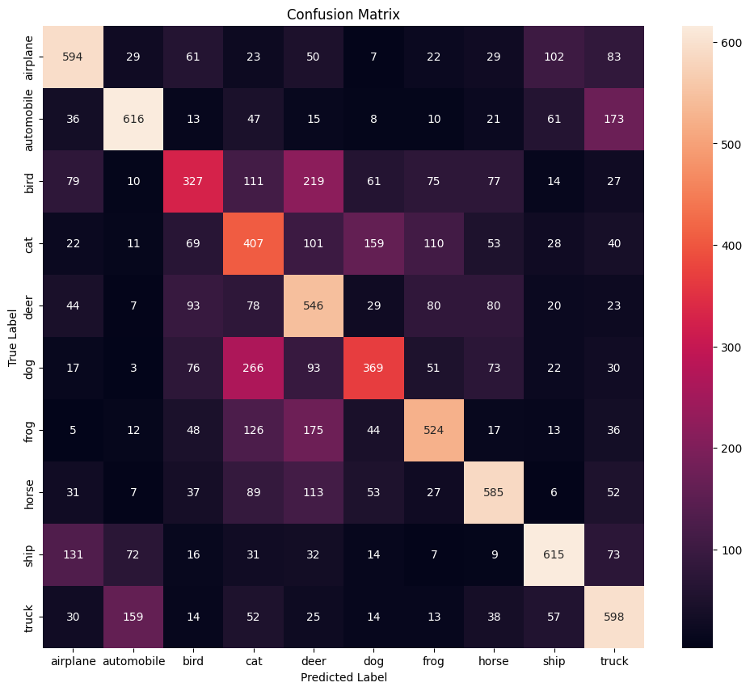
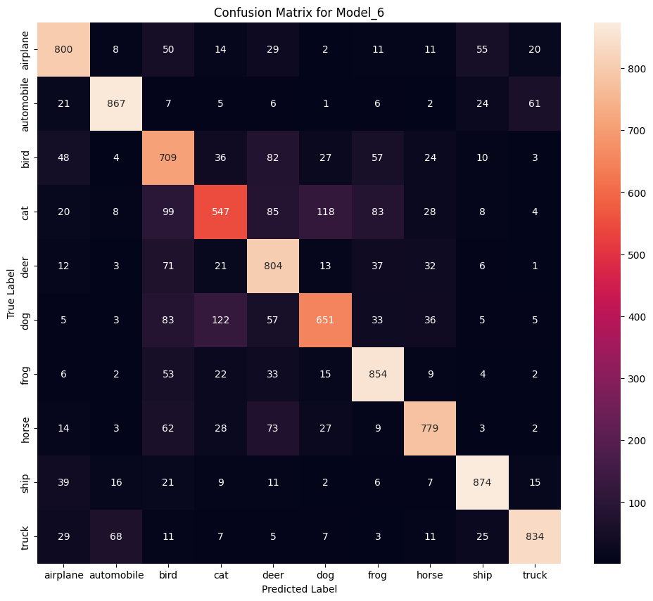

# Image Classification Experiments on the CIFAR-10 Dataset

This project documents a series of experiments in image classification on the CIFAR-10 dataset using PyTorch. The primary goal is to demonstrate an iterative process of model building, starting from a simple Fully-Connected Network and progressing to a more suitable Convolutional Neural Network (CNN).

The project covers key concepts such as:
- Addressing **underfitting** by increasing model capacity.
- Combating **overfitting** using regularization techniques like Dropout and Batch Normalization.
- Understanding the architectural limitations of Dense Networks for image tasks.
- Proving the effectiveness of CNNs for learning spatial features.

## The Dataset

The project uses the CIFAR-10 dataset, which consists of 3x32x32 color images across 10 distinct classes: `airplane`, `automobile`, `bird`, `cat`, `deer`, `dog`, `frog`, `horse`, `ship`, `truck`.

## Experiments and Results

A series of models were trained to compare different architectures and regularization techniques. The final results are summarized below.

| Model ID | Architecture | Test Accuracy | Overfitting Gap |
|---|---|---|---|
| Model_0 | Dense (1 Hidden Layer) | ~49% | Underfitting |
| Model_2 | Dense (2 Layers + Dropout) | ~52% | ~10% |
| Model_3 | CNN (10 Hidden Units) | ~67% | ~1.5% |
| Model_5 | CNN (50 Units + Dropout) | ~76% | ~14% |
| **Model_6** | **CNN (50 Units + BatchNorm)** | **~77.22%** | **~13.3% (Best Performance)** |

## Analysis: Dense Network vs. Convolutional Neural Network

The most critical finding of this project is the performance difference between the best Dense Network (`Model_2`) and the best CNN (`Model_6`).

<table>
  <tr>
    <td align="center"><strong>Confusion Matrix for Model_2 (Dense)</strong><br><em>Test Accuracy: ~52%</em></td>
    <td align="center"><strong>Confusion Matrix for Model_6 (CNN)</strong><br><em>Test Accuracy: ~77.22%</em></td>
  </tr>
  <tr>
    <td align="center"></td>
    <td align="center"></td>
  </tr>
</table>

- **Dense Network Failure:** The dense network (`Model_2`) struggled immensely with visually similar classes, particularly animals. For instance, it misclassified a large number of "cat" images as "dog". This demonstrates its inability to learn discriminative spatial features.
- **CNN Success:** The CNN model (`Model_6`) shows a dramatic improvement across all classes. The accuracy on challenging classes like "bird" more than doubled, and the "cat" vs. "dog" confusion was reduced by over 50%. This proves that the convolutional layers are successfully extracting meaningful spatial patterns (edges, textures, shapes) that the dense network could not.

### Examples of Incorrect Predictions (Model_6)

Even the best model has its limitations. Below are some examples where `Model_6` failed, often due to unusual angles, ambiguous backgrounds, or features shared between classes.


## Conclusion

This project successfully demonstrates the iterative process of developing a deep learning model. It concludes that while Fully-Connected Networks are a good starting point, their inability to process spatial information makes them unsuitable for complex image tasks.

By switching to a **Convolutional Neural Network** and applying **Batch Normalization**, the test accuracy was improved from a plateau of **~52%** to a final score of **77.22%**. This highlights that choosing the right model architecture is the most critical factor for success in computer vision tasks.

## Project Status: v2.0 - 84.43% Accuracy

This project has successfully progressed from a v1.0 baseline (77.22%) to a v2.0 model achieving **84.43%** test accuracy. This was accomplished by implementing **Data Augmentation** to solve overfitting and systematically increasing model capacity (from 2 blocks/50 units to **3 blocks/128 units**).

## Next Steps: Model Deployment

* [x] ~~Improve model accuracy to 85%~~ (Done, 84.43% achieved)
* [ ] **Convert the trained model (`.pth`) to `.onnx` format.**
## Setup and Usage

To run this project on your local machine:

1.  Clone this repository.
2.  Install the required libraries:
    ```bash
    pip install -r requirements.txt
    ```
3.  Run the `cifar_10.ipynb` file in a Jupyter Notebook or a similar environment. The trained model weights for the best model (`Model_6`) are saved in the `models/` directory.
